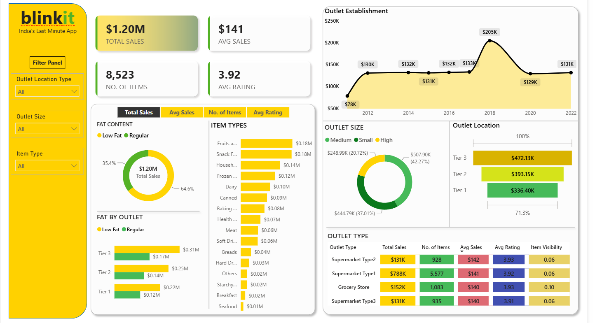

# blinkit-sales-analytics-dashboard-powerbi

# 🛒 Blinkit Sales Analytics Dashboard

An interactive **Power BI Dashboard** built to analyze Blinkit's sales performance, outlet efficiency, customer ratings, and product categories. The dashboard transforms raw sales data into actionable business insights through dynamic visualizations, KPIs, and filters.

---

## 📊 Dashboard Preview



---

# 📌 Project Overview

This project demonstrates the complete Business Intelligence workflow:

- Data Cleaning
- Data Transformation
- Data Modeling
- DAX Calculations
- Dashboard Design
- Business Insights

The dashboard enables users to analyze sales performance from multiple perspectives including outlet type, outlet size, outlet location, item categories, and establishment year.

---

# 🎯 Objectives

- Analyze overall sales performance.
- Compare sales across different outlet types.
- Identify high-performing product categories.
- Monitor customer ratings.
- Track outlet performance over time.
- Provide interactive filtering for better decision-making.

---

# 🛠 Tech Stack

- Power BI Desktop
- Power Query
- DAX
- Microsoft Excel

---

# 📂 Dataset

The dataset contains information such as:

- Outlet ID
- Outlet Type
- Outlet Size
- Outlet Location
- Establishment Year
- Item Type
- Fat Content
- Sales
- Customer Rating
- Item Visibility
- Item Weight

---

# 📈 Dashboard Features

### KPI Cards

- Total Sales
- Average Sales
- Number of Items
- Average Rating

---

### Interactive Filters

- Outlet Location Type
- Outlet Size
- Item Type

---

### Visualizations

- Sales Trend by Outlet Establishment Year
- Fat Content Distribution
- Sales by Item Type
- Sales by Outlet Size
- Sales by Outlet Location
- Fat Content by Outlet
- Outlet Type Performance Matrix

---

# 📊 Key Business Insights

- Total Sales reached **$1.20M**.
- Medium-sized outlets generated the highest revenue.
- Tier 3 outlets contributed the largest share of sales.
- Fruits and Snack Foods were among the top-selling categories.
- Average customer rating remained around **3.9**, indicating consistent customer satisfaction.
- Supermarket Type1 contributed the highest number of sold items.

---

# 🧮 DAX Measures Used

Examples include:

```DAX
Total Sales = SUM(Sales[Item_Outlet_Sales])

Average Sales = AVERAGE(Sales[Item_Outlet_Sales])

Number of Items = COUNT(Sales[Item_Identifier])

Average Rating = AVERAGE(Sales[Rating])
```

---

# 📁 Repository Structure

```
Blinkit-Sales-Dashboard
│
├── Dashboard/
│   └── Blinkit Dashboard.pbix
│
├── Dataset/
│   └── BlinkIT Grocery Data.xlsx
│
├── README.md
└── LICENSE
```

---

# 🚀 How to Use

1. Download the repository.
2. Open the `.pbix` file in **Power BI Desktop**.
3. Refresh the dataset if required.
4. Explore the dashboard using the slicers and interactive visuals.

---

# 📚 Skills Demonstrated

- Business Intelligence
- Data Analytics
- Dashboard Design
- Data Cleaning
- Data Transformation
- Data Modeling
- DAX
- Power Query
- KPI Reporting
- Data Visualization

---

# 📌 Future Improvements

- Add Profit Analysis
- Add Inventory Dashboard
- Include Customer Segmentation
- Forecast Future Sales
- Mobile-Optimized Dashboard
- Drill-through Pages
- Row-Level Security (RLS)

---

# 👨‍💻 Author

**Harsh**

LinkedIn: https://www.linkedin.com/in/harsh-8535b2248/

---
